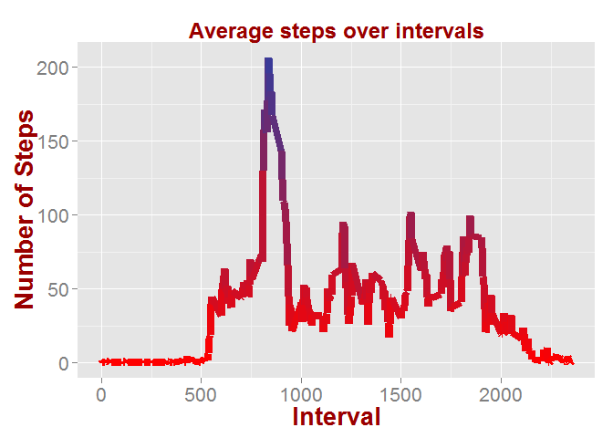
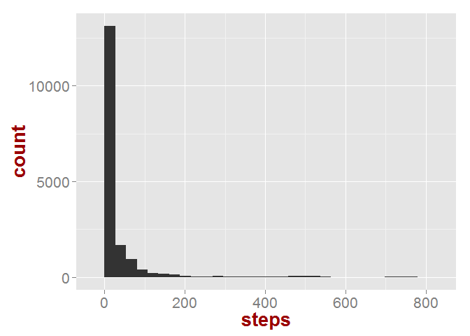
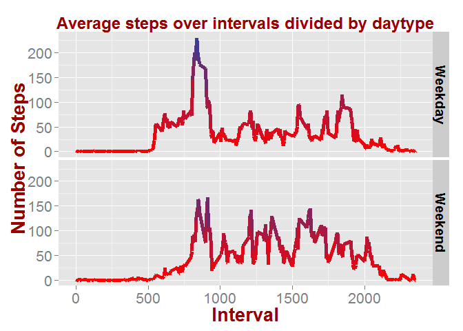

# Reproducible Research: Peer Assessment 1


## Loading and preprocessing the data
The data is read directly from the zip-file. The code for reading the data is below:  

```r
library(lubridate)
library(data.table)
in_data=data.table(read.table(unz("activity.zip","activity.csv"),sep=",",header=T,na.strings="NA",
                   colClasses = c("numeric","Date","numeric")))
```

## What is mean total number of steps taken per day?


```r
library(ggplot2)
options(scipen=100)
ggplot(data=in_data)+geom_histogram(aes(x=steps))+
  theme(axis.title.x = element_text(face="bold", colour="#990000", size=20),
           axis.text.x  = element_text(angle=0, vjust=0.5, size=16),
        axis.title.y = element_text(face="bold", colour="#990000", size=20),
           axis.text.y  = element_text(angle=0, vjust=0.5, size=16),
        plot.title = element_text(size=18,face="bold", colour="#990000"),
        legend.position="none")
```

 


###Calculating the mean and median steps per day


```r
steps_per_day=aggregate(list(steps = in_data$steps), 
          list(day = cut(in_data$date, "1 day")), 
          sum)
mean_steps_per_day=mean(steps_per_day$steps,na.rm = TRUE)
med_steps_per_day=median(steps_per_day$steps,na.rm = TRUE)
```
The mean steps per day are:$10766$.  
The median steps per day are:$10765$.  


## What is the average daily activity pattern?


```r
a=data.frame(in_data[,list(mean=mean(steps,na.rm = T)),by=factor(in_data$interval)])
a$factor=as.numeric(as.character(a$factor))
ggplot(a,aes(x=factor,y=mean))+geom_line(aes(colour=mean),size=3)+
  scale_colour_gradient2(mid="red")+
  ggtitle("Average steps over intervals")+
  scale_shape_discrete(name  ="Payer")+
  scale_y_continuous(name="Number of Steps")+
  scale_x_continuous(name="Interval")+
  theme(axis.title.x = element_text(face="bold", colour="#990000", size=20),
           axis.text.x  = element_text(angle=0, vjust=0.5, size=16),
        axis.title.y = element_text(face="bold", colour="#990000", size=20),
           axis.text.y  = element_text(angle=0, vjust=0.5, size=16),
        plot.title = element_text(size=18,face="bold", colour="#990000"),
        legend.position="none")
```

 

```r
max_step_interval=a$factor[which.max(a$mean)]
```
The interval 835 has the maximum number of steps across all days.


## Imputing missing values


```r
miss_data=sum(is.na(in_data$steps))
```
A total of 2304 values are missing from the data.  

Impute the missing values using the mean

```r
imp_data=in_data
for (i in which(is.na(in_data$steps))){
  if(is.na(in_data$steps[i])){
    imp_data$steps[i]=round(a$mean[which(a$factor==in_data$interval[i])])
  }
    
}
```
###Histogram of imputed data  

```r
ggplot(data=imp_data)+geom_histogram(aes(x=steps))+
  theme(axis.title.x = element_text(face="bold", colour="#990000", size=20),
           axis.text.x  = element_text(angle=0, vjust=0.5, size=16),
        axis.title.y = element_text(face="bold", colour="#990000", size=20),
           axis.text.y  = element_text(angle=0, vjust=0.5, size=16),
        plot.title = element_text(size=18,face="bold", colour="#990000"),
        legend.position="none")
```

 

###Calculate steps per day and get mean and median

```r
steps_per_day=aggregate(list(steps = imp_data$steps), 
          list(day = cut(imp_data$date, "1 day")), 
          sum)
mean_steps_per_day_imp=mean(steps_per_day$steps)
med_steps_per_day_imp=median(steps_per_day$steps)
```
|   |Before Imputing  | After Imputing
---|------------- | -------------
**Mean**|$10766$  | $10766$
**Median**|$10765$  | $10762$

While there is no change in the mean number of steps, the median decreases due to the imputing


## Are there differences in activity patterns between weekdays and weekends?

###Calculate average for weekend and weekdays

```r
#identify weekday or weekend
imp_data$daytype <- as.factor(ifelse(weekdays( imp_data$date) %in% c("Saturday","Sunday"), "Weekend", "Weekday")) 

#Calculate mean
b=data.frame(imp_data[,list(mean=mean(steps,na.rm = T)),by=.(factor(imp_data$interval),factor(imp_data$daytype))])
b$factor=as.numeric(as.character(b$factor))
```
###Plot 

```r
ggplot(b,aes(x=factor,y=mean))+geom_line(aes(colour=mean),size=2)+
  scale_colour_gradient2(mid="red")+facet_grid(factor.1~.)+
  ggtitle("Average steps over intervals divided by daytype")+
  scale_shape_discrete(name  ="Payer")+
  scale_y_continuous(name="Number of Steps")+
  scale_x_continuous(name="Interval")+
  theme(axis.title.x = element_text(face="bold", colour="#990000", size=20),
           axis.text.x  = element_text(angle=0, vjust=0.5, size=16),
        axis.title.y = element_text(face="bold", colour="#990000", size=20),
           axis.text.y  = element_text(angle=0, vjust=0.5, size=16),
        plot.title = element_text(size=18,face="bold", colour="#990000"),
        strip.text.y = element_text(size=14, face="bold"),
        legend.position="none")
```

 


