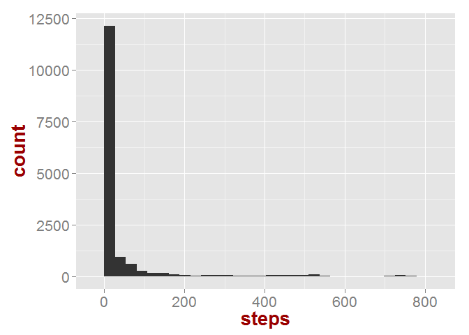

# Reproducible Research: Peer Assessment 1


## Loading and preprocessing the data
The data is read directly from the zip-file. The code for reading the data is below:

```r
library(lubridate)
in_data=read.table(unz("activity.zip","activity.csv"),sep=",",header=T,na.strings="NA",
                   colClasses = c("numeric","Date","numeric"))
head(in_data)
```

```
##   steps       date interval
## 1    NA 2012-10-01        0
## 2    NA 2012-10-01        5
## 3    NA 2012-10-01       10
## 4    NA 2012-10-01       15
## 5    NA 2012-10-01       20
## 6    NA 2012-10-01       25
```

```r
max(in_data$steps,na.rm = T)
```

```
## [1] 806
```

```r
class(in_data$steps)
```

```
## [1] "numeric"
```

## What is mean total number of steps taken per day?


```r
library(ggplot2)
p=ggplot(data=in_data)+geom_histogram(aes(x=steps))
p
```

 

```r
# hist(in_data$steps)
steps_per_day=aggregate(list(steps = in_data$steps), 
          list(day = cut(in_data$date, "1 day")), 
          sum)
mean_steps_per_day=mean(steps_per_day$steps,na.rm = TRUE)
med_steps_per_day=median(steps_per_day$steps,na.rm = TRUE)
mean_steps_per_day
```

```
## [1] 10766.19
```

```r
med_steps_per_day
```

```
## [1] 10765
```


## What is the average daily activity pattern?


## Imputing missing values


## Are there differences in activity patterns between weekdays and weekends?
